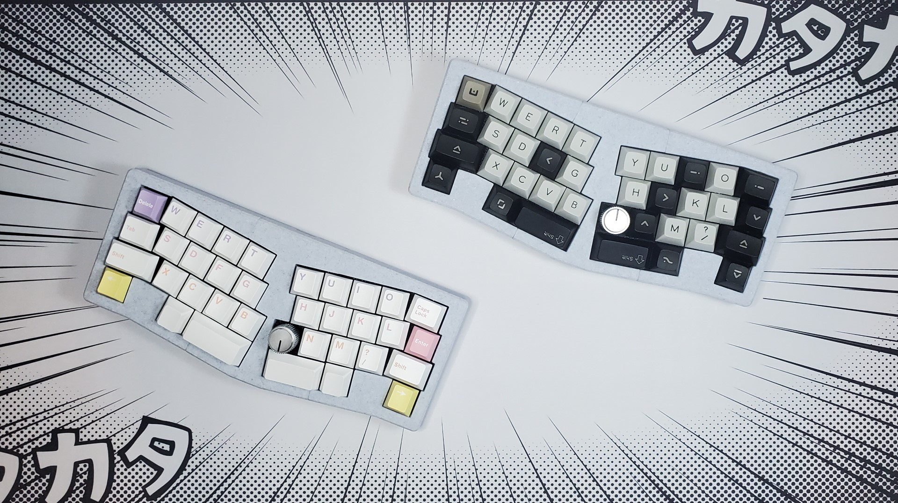
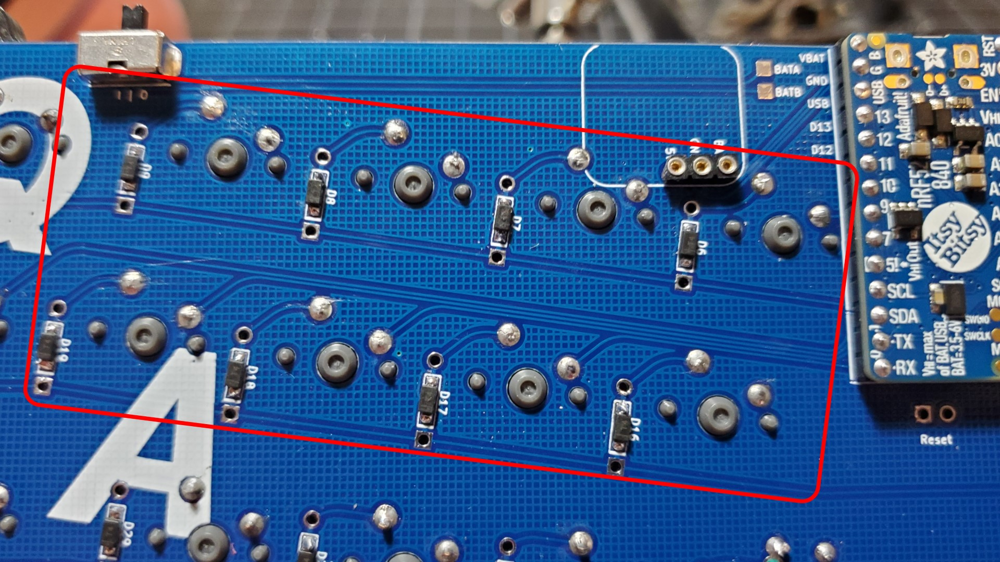
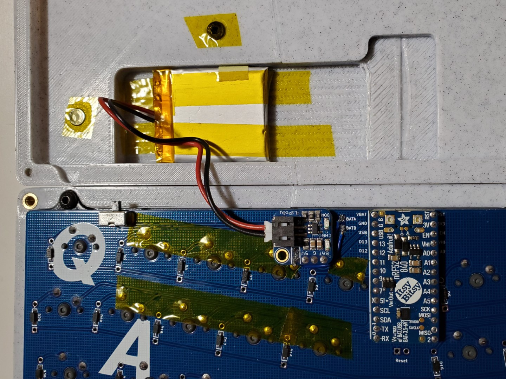
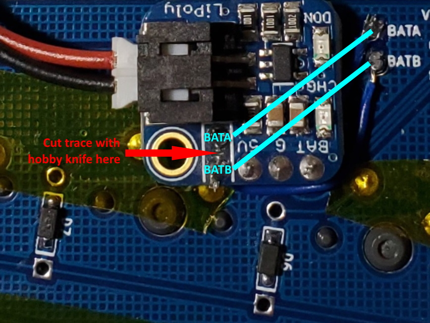

# QALBLE

An ergo 35% 3d printed wireless mechanical keyboard, born from the thought of "Imagine QAZ but split like an Alice 😳"

The _BLE_ is a misnomer since the keyboard can be wired or wireless depending on the ItsyBitsy microcontroller development board used.



### Related Projects

[QAL (handwire)](https://github.com/somepin/qal-handwire) - The original integrated plate handwired version.

[Adalyn](https://github.com/MarvFPV/Adalyn/) - Aesthetic top mount design featuring a PCB with an integrated microcontroller, by MarvFPV and tominabox1.

## Project Structure

`/case` - STLs to print and STEPs for modification. The `nonsplit` case is untested, and the `flat` case only works with wired builds.

`/firmware` - ZMK and Vial-QMK firmware files.

`/pcb` - KiCad 6 files.

`/img` - Readme images.

The Releases page contains the gerbers for PCB production and the `.uf2` file for Vial-QMK firmware flashing.

## Components

The PCB is designed to be hand-soldered with no PCBA services required. Mouser links to components are included for convenience.

| Part                                                                                                                                                                                                                                   | Quantity | Notes                                                                                         |
| -------------------------------------------------------------------------------------------------------------------------------------------------------------------------------------------------------------------------------------- | -------- | --------------------------------------------------------------------------------------------- |
| 1N4148 Diodes ([Through hole](https://www.mouser.com/ProductDetail/onsemi-Fairchild/1N4148?qs=sGAEpiMZZMueQxo7L%2FBPyGk1oWHOqz4M)/[SMD](https://www.mouser.com/ProductDetail/Panjit/1N4148W_R1_00001?qs=sPbYRqrBIVnqVztCqPNVrw%3D%3D)) | 36       | Either through hole or SMD SOD-123 diodes are supported                                       |
| [Adafruit ItsyBitsy nRF52840](https://www.mouser.com/ProductDetail/Adafruit/4481?qs=sGAEpiMZZMv0NwlthflBi0wxcEySjLivFAoxskokx6U%3D)                                                                                                    | 1        | Bluetooth module daughterboard                                                                |
| [Adafruit LiIon/LiPoly Backpack](https://www.mouser.com/ProductDetail/Adafruit/2124?qs=GURawfaeGuBUa48u6WxTSg%3D%3D)                                                                                                                   | 1        | Charging circuit daughterboard                                                                |
| [Adafruit LiPo Battery 3.7V 500mAh](https://www.mouser.com/ProductDetail/Adafruit/1578?qs=sGAEpiMZZMsKEdP9slC0Ye7SoJ6cuRArlH3mXRQt04M%3D)                                                                                              | 1        | Adafruit battery must be used due to LiIon/LiPoly Backpack JST connector polarity             |
| [EC11 Rotary Encoder](https://www.mouser.com/ProductDetail/Bourns/PEC11R-4215F-S0024?qs=Zq5ylnUbLm5lAqmKF80wzQ%3D%3D)                                                                                                                  | 1        | Optional, 15mm height is reccomended                                                          |
| [Mill-Max Ultra Low Profile Sockets](https://www.mouser.com/ProductDetail/575-3154716441003000)                                                                                                                                        | 1        | Needed to socket ItsyBitsy/LiPo backpack and fit them into the case, P/N 315-47-164-41-003000 |
| [Mill-Max Machined IC Pins](https://www.mouser.com/ProductDetail/575-3320000150000030)                                                                                                                                                 | 31       | Optional, can be substituted with trimmed diode legs, P/N 3320-0-00-15-00-00-03-0             |
| MX Switches                                                                                                                                                                                                                            | 35-36    | Quantity depends on if an encoder is used                                                     |
| [Slide Switch SPDT Right Angle](https://www.mouser.com/ProductDetail/655-1825232-1)                                                                                                                                                    | 1        | Power switch for Bluetooth                                                                    |

If going wired instead of wireless, an [Adafruit ItsyBitsy RP2040](https://www.mouser.com/ProductDetail/Adafruit/4888?qs=sGAEpiMZZMv0NwlthflBix27tBf6zPUGQjVXh0qlU%2F4%3D) can be used instead of the ItsyBitsy nRF53840, and the LiIon/LiPoly Backpack, LiPo Battery, and Slide Switch would not be needed.

## PCB Assembly Notes

The ItsyBitsy development board is socketed with the micro-usb port facing the top of the case. Ultra low profile Mill-Max sockets must be used for both the ItsyBitsy and LiPo Backpack so they can fit in the case.

If using a rotary encoder, it can be installed in either the left B or right B key position, but not both.

If building this keyboard wired, skip to [Case Notes](#case-notes). The following is only for use with the ItsyBitsy nRF53840 to make a wireless keyboard.

When installing switches, clip the following 8 switches' pins flush to the PCB before soldering:



This is done just so the switch pins have less risk of poking the battery underneath, as so:



I also taped over the flush switch pins and screws underneath, just in case.

When installing the LiPo Backpack the following modifications have to be made to use the power switch:



First, cut the trace in between BATA and BATB on the LiPo Backpack with a hobby knife. Then, solder short strips of wire from BATA and BATB on the backpack to the BATA and BATB jumper pads on the PCB.

### !!! IMPORTANT !!!

**The backpack can only be used with Adafruit batteries. Other batteries may have different voltage, chemistry, polarity or pinout. DO NOT plug in other batteries to the backpack's JST port.**

## Case Notes

The case is designed to be 3d printed and **not** machined by a CNC router.

### Hardware

- 9x M3x6x5mm [heat set inserts](https://www.amazon.com/Printing-Embedment-Knurled-Automotive-Notebook/dp/B09KZSJS88)
- 5x M3x12mm [button head screws](https://www.amazon.com/DYWISHKEY-Pieces-Button-Screws-Wrench/dp/B07VRC7ZL5) to screw the case together
- 4x M3x8mm button head screws to mount the plate to the case top
- 3x M3x6mm [flat head screws](https://www.amazon.com/Uxcell-a16011300ux0870-M3x6mm-Carbon-Countersunk/dp/B01E5EOIWW) to attach the bottom pieces together

### Printing

The case is printed at 0.2mm layer height with the flat faces of each piece face down on the print bed. Enable supports for the wedge piece(s) for the ItsyBitsy/Backpack/battery cavity. The `nonsplit` case should fit on at least a 250mm print bed, but it is untested. Otherwise, the `split` case was made to fit on a 150mm print bed.

### Assembly

If using the `split` case, the pieces of the case top, bottom, and wedge are super glued together.

All 9 M3 heat set inserts are installed in the top section of the case. Install the heat set insert at the front of the case at your own discretion. The case wall is too thin around this heat set insert, so the plastic may melt and sag at this part.

After installing the heat set inserts, screw in the plate/PCB assembly into the top of the case. The bottom half of the case screws in to the wedge directly, without heat set inserts, so be careful to not overtighten and strip the plastic.

When attaching the case top with plate/PCB to the bottom/wedge, align it so that the ItsyBitsy and Lipo Backpack slot into their respective spaces and the power switch can poke through the hole. Also ensure that the battery fits in the case.

Finally, screw the case halves together.

## Firmware

### ZMK (Wireless - ItsyBitsy nRF53840)

Fork my [ZMK config repo](https://github.com/somepin/zmk-config/tree/qalble) and edit the `config/boards/shields/qalble/qalble.keymap` file to customize your keymap. If this is your first time using ZMK, follow the [ZMK Docs](https://zmk.dev/docs/user-setup/) to get started.

### Vial-QMK (Wired - ItsyBitsy RP2040)

Flash the `somepin_qal_vial.uf2` file in [Releases](https://github.com/somepin/qalble/releases) to the ItsyBitsy RP2040.

#### Manual Compilation

Use the `rp2040-fix2` branch of [vial-qmk](https://github.com/vial-kb/vial-qmk/tree/rp2040-fix2).

Copy/paste the files in `/firmware/vial-qmk` to `vial-qmk/keyboards/qal`.

Compile via `make` in the top directory of the firmware after setting up your build environment:
```
make qal:vial
```

Convert firmware into uf2 format:
```
python3 util/uf2conv.py .build/qalble_vial.bin -f 0xe48bff56 -b 0x10000000 -o qalble_vial.uf2
```
I had to use the conversion script manually since using `make qal:vial:uf2` would cause an error.

### Flashing

#### First flash

While the ItsyBitsy is unsocketed and unplugged from the computer, hold down the SW/BOOT tactile switch when plugging it in to launch the bootloader. A new file explorer window will open, then drag and drop the corresponding `.uf2` firmware file into the new window to flash.

#### Subsequent flashes

For wireless/ZMK, use the `&bootloader` keycode while the keyboard is switched off and plugged in to launch the bootloader.

For wired/QMK, use Bootmagic by holding the top-left most key (Q) while plugging the keyboard in to launch the bootloader.

### Issues

* The current hardware (ItsyBitsy nRF52840+LiPo Backpack) does not support getting the battery level in ZMK, so the battery will always appear fully charged in Windows despite it discharging

* ZMK sometimes loses connection over bluetooth
  * I fix this by resetting the board via the power switch and quickly switching profiles

* Vial configuration such as combos are lost
  * Backup Vial keymap (File > Save current layout...), reflash, then reload the keymap (File > Load saved layout...)
